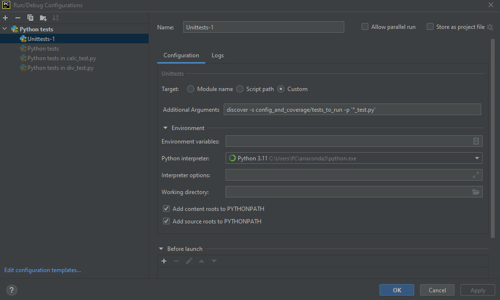

### Создание конфигурации
1. В Pycharm в правом верхнем углу, слева от кнопки ```Run``` во всплывающем меню выбрать ```Edit Configurations...```



2. В левом верхнем углу окна выбрать ```Add new configuration```
3. Выбрать ```Unittest```
4. Указать имя создаваемой конфигурации ```Name: MyUnitTests```
5. Указать ```Target: Custom```
6. Указать ```Additional Arguments:```

Additional Arguments:

```discover -s PATH -p '*_test.py'```

```, где PATH-абсолютный! путь к папке с тестами```

Данные настройки позволяют выполнять все тесты, находящиеся в указанной папке нажатием одной кнопки, что очень удобно.

### Функция Run with Coverage (Покрытие)
доступна в коммерческой версии PyCharm и позволяет отслеживать какие именно строчки кода покрыты тестами, а какие нет,
а также общий процент покрытия конкретного модуля.
