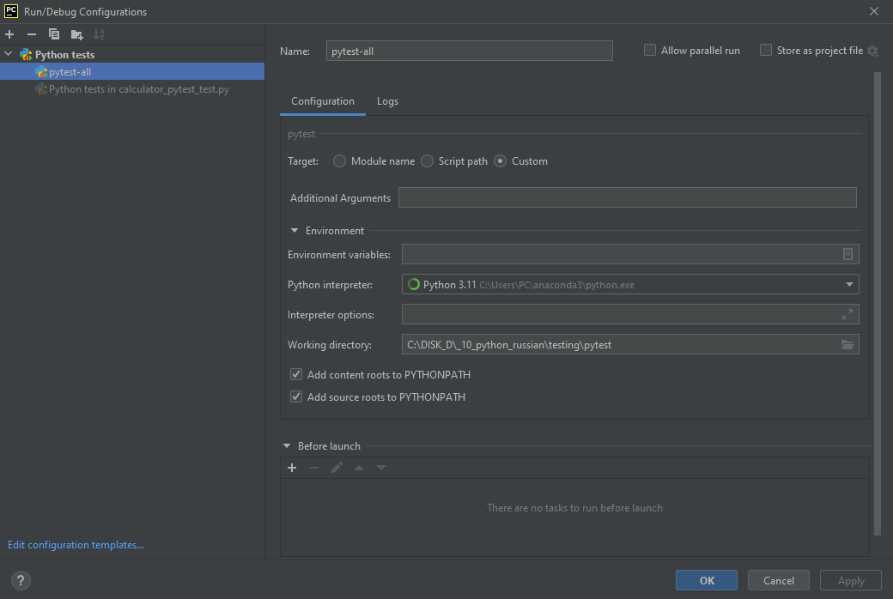

### Pytest

Pytest - главный конкурент Unittest, которого он опережает по популярности.

Почти все питоновские тесты пишутся именно с использованием этих двух фреймворков.

### Pytest [-]
- Pytest не идет в комплекте с питоном, его нужно устанавливать и импортировать
- Pytest не исполняет doctest, интегрированный в unittest
- Pytest подменяет явняй код неявным (много магии)
- Pytest не похож на большинство тестовых библиотек

### Pytest [!]
> Pytest РАСПОЗНАЁТ ТОЛЬКО ФАЙЛЫ С ИМЕНЕМ ```'*_test.py'```

### Pytest [+]

- Pytest не требует знаний ООП
- Pytest-тесты легко читаются
- Информативный комментарий при падении теста
- Pytest в составе конфигурации исполняет также и unittest-файлы

### Настройка конфигураций pytest:


```
В левой колонке выбираем pytest
Name: [заполняем]
Target: Custom
Working directory: [указываем путь к папке с тестами]

[!]pytest распознаёт только файлы с именами '*_test.py'
```